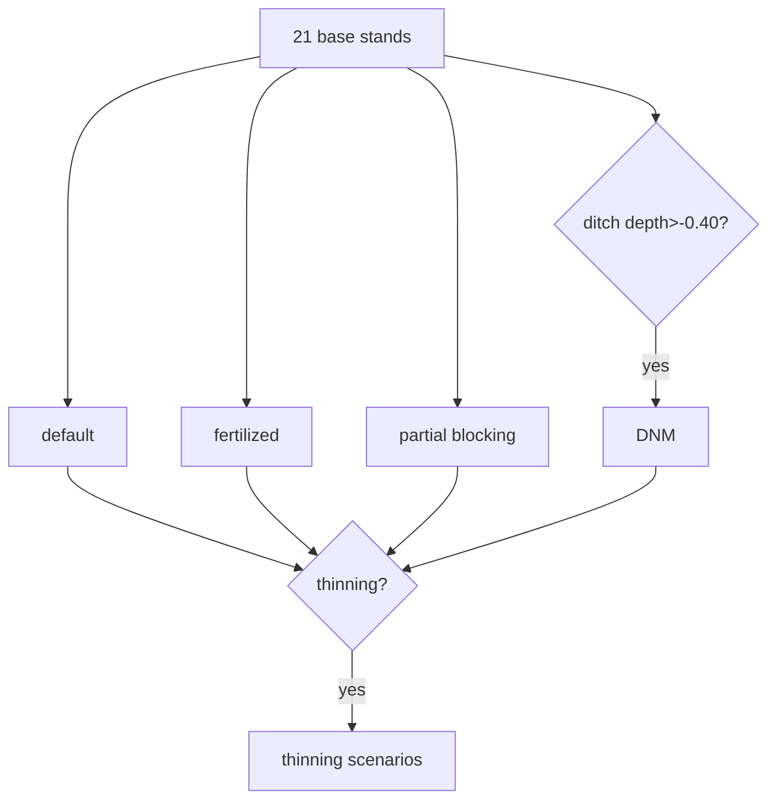

# Paroninkorpi simulations

## Logic

```mermaid
flowchart TD
    A[21 base stands] --> B[default];
    A --> C[fertilized];
    A --> D[partial blocking];
    A --> F{ditch depth>-0.40?} -->|yes| E[DNM];
    B --> G{thinning?};
    C --> G;
    D --> G;
    E --> G;
    G --> |yes| H[thinning scenarios]
```

This problem is *embarrasingly parallel*: each one of the 21 sites does not depend on the rest.
